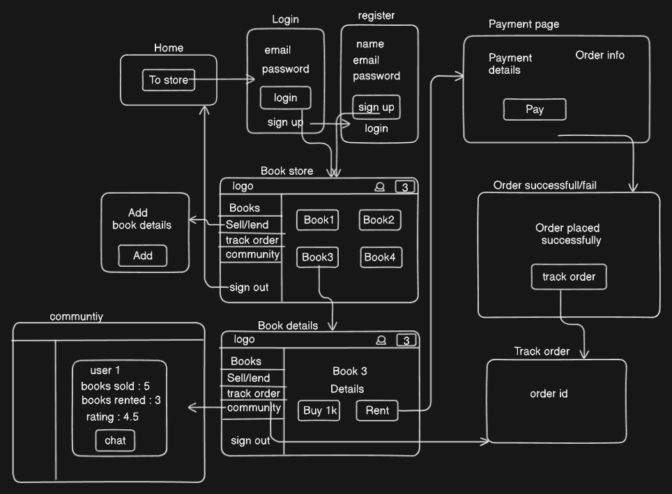

### Persona

- Seller / lender
- Buyer / renter
- Admin

### Requirements

- An online store to help anyone buy/sell/rent/lend used books.
- A home page to promote.
- A way to sign up and login.
- A way to list down books with details like name, image, stock ,price, etc.
- A way to see book details.
- A way to add or move books to the cart.
- A way to pay and checkout.
- A way to say order success/ failure.
- A way to track order.
- A way for users to submit a book for sale and rent.
- A way for users to communicate with each other.
- A way to notify users.
- A way to change setting and preferences.
- A way for admin to check status, inventory, etc.
- Responsive design.

### Wireframe

### Pages

- Home page -> /home
- Store -> /store
- Book details -> /store{id}
- Track order -> /store/track-order
- Communities -> /store/communities
- About us -> /store/about
